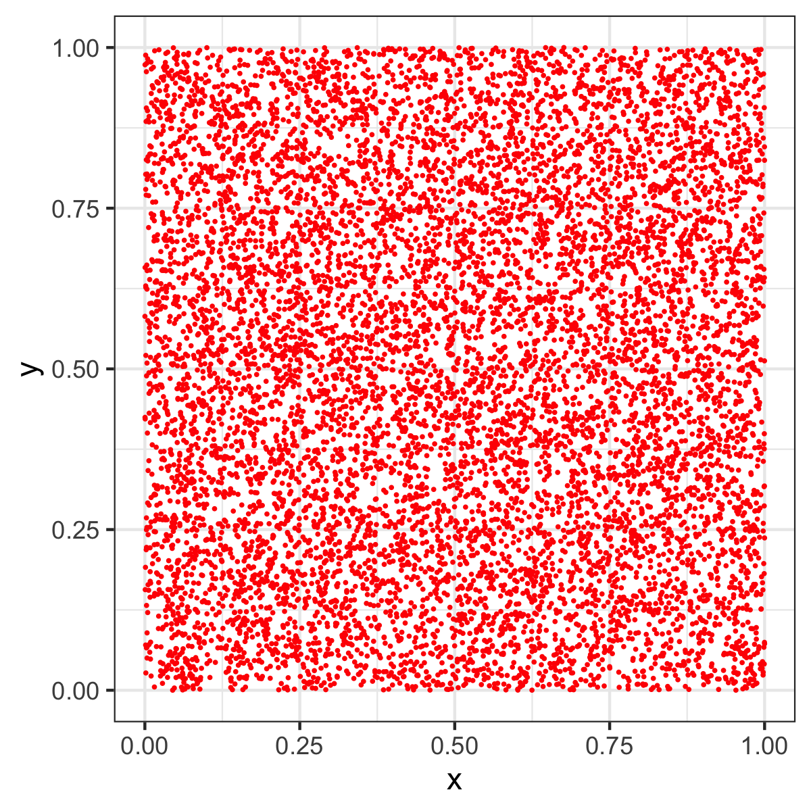

# MonteCarlo-Pi
 simple pi generator to test speed in R
 
## Timing

Computing 2 million steps takes about 103 ms. A typical result is `3.142`, so result is about 0.01% accurate. 

## Model and Accuracy

The accuracy gets better with iterations. We can fit an exponential model that predicts the accuracy of the generated number.

## Random Generator

The random generator is quite important, so here is a rendering of an image that shows the randomness of the generator:

