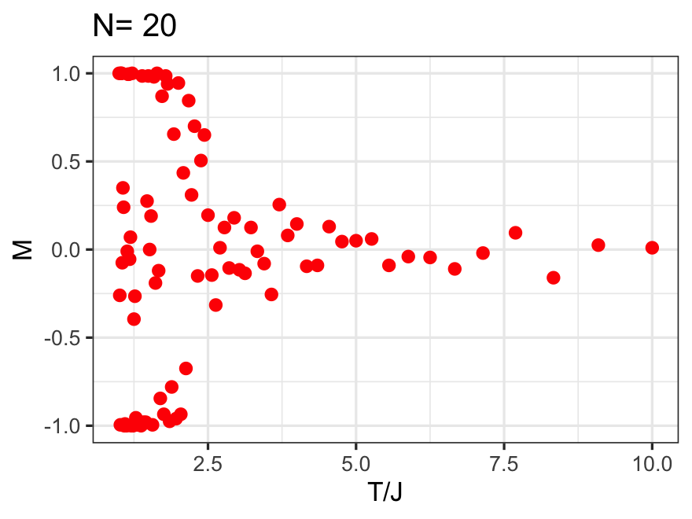

# MonteCarlo-Pi
 simple pi number generator to test speed in R
 
## Timing

Computing 2 million steps takes about 103 ms on a typical computer. A typical result is `3.142`, so result is about 0.01% accurate. 

## Model and Accuracy

The accuracy gets better with iterations. We can fit an power law that predicts the accuracy of the generated number. If accuracy **A** (in %) needs to be found for **n** iterations, then: **A = 97 n-0.586** - pretty slow divergence. The pre-factor 97 is the "percentage", so there can be really just one fitting parameter, which is the power exponent.

## Random Generator

The random generator is quite important, so here is a rendering of an image that shows the randomness of the generator. This image has 10000 data points:

## Ising 2D Model

Monte Carlo simulation for Ising 2D model with example result:

