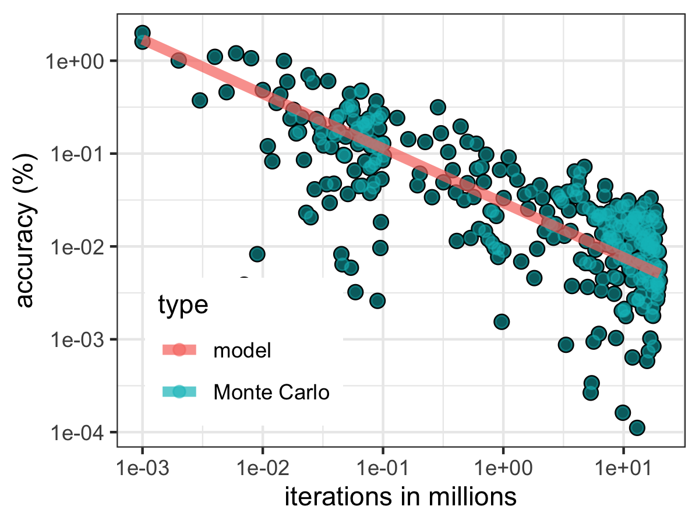
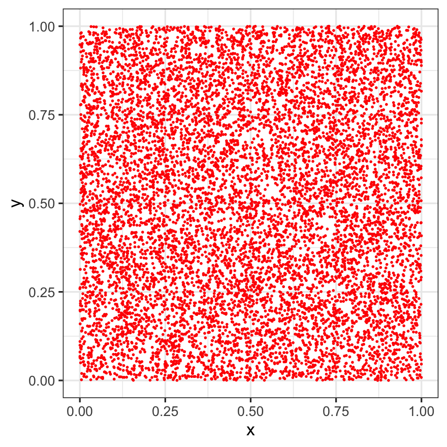

# MonteCarlo-Pi
 Simple pi number generator to test speed in R, demonstrates how to run code on multiple cores in parallel, see [computePi-parallel.R](computePi-parallel.R). The code is:

 ```R
  q.x = runif(num.iterations)
  q.y = runif(num.iterations)
  l = q.x*q.x+q.y*q.y
  n = length(which(l<=1))
  pi = n/num.iterations*4
 ```

## Timing

Computing 2 million steps takes about 103 ms on a typical computer. A typical result is `3.142`, so result is about 0.01% accurate.


## Model and Accuracy

The accuracy gets better with iterations. We can fit an power law that predicts the accuracy of the generated number. If accuracy **A** (in %) needs to be found for **n** iterations, then: **A = 97 n<sup>-0.586</sup>** - pretty slow divergence. The pre-factor 97 is the "percentage", so there can be really just one fitting parameter, which is the power exponent.




## Parallelization of the Code

A speed increase of about a factor 4-6 is achieved when running 100 billion randomizations. It uses the `foreach` command, which can be parallelized with `%dopar%`, the readout could be faster with `.combine-c` possibly:

```R
computePiParallel <- function(num.iterations) {
  c <- function(no) {
    foreach (i=1:num.cores,.combine=rbind) %dopar% {
      q.x = runif(no)
      q.y = runif(no)
      l = q.x*q.x+q.y*q.y
      n = length(which(l<=1))
    }
  }
  sum(c(num.iterations/num.cores))/num.iterations*4
}
```

## Random Generator

The random generator is quite important, so here is a rendering of an image that shows the randomness of the generator. This image has 10000 data points:


