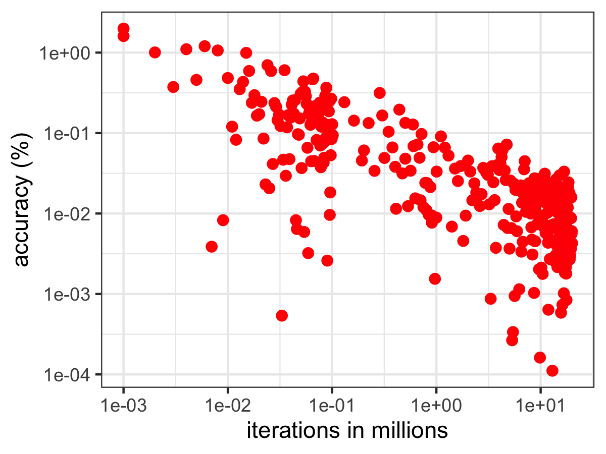

# MonteCarlo-Pi
 simple pi generator to test speed in R
 
## Timing

Computing 2 million steps takes about 103 ms. A typical result is `3.142`, so result is about 0.01% accurate. The accuracy gets better with iterations.

